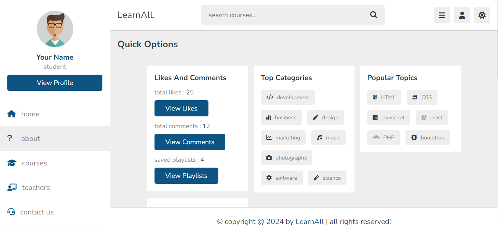
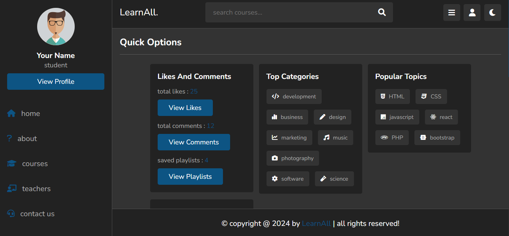

# LearnAll

The E-Learning Platform that offers top-notch materials and courses to African youth, emphasising technology, entrepreneurship, and sustainable development. This document outlines the platform's software needs. This platform aims to close the skills gap and support individual and collective development throughout the continent.

You can even use dark mode

You can register as a student and also as a teacher 

* As a student
  

* As a teacher 
  

### The Author

   [Elvis Guy Bakunzi](mailto:e.bakunzi@alustudent.com)